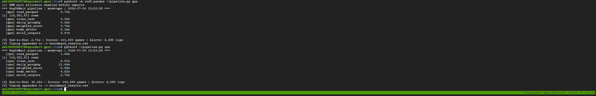
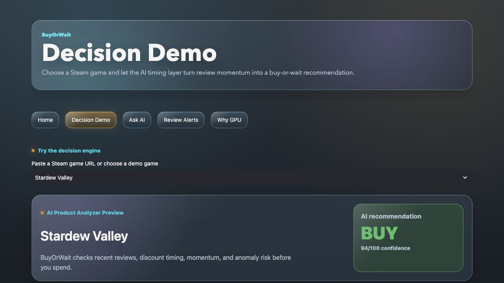
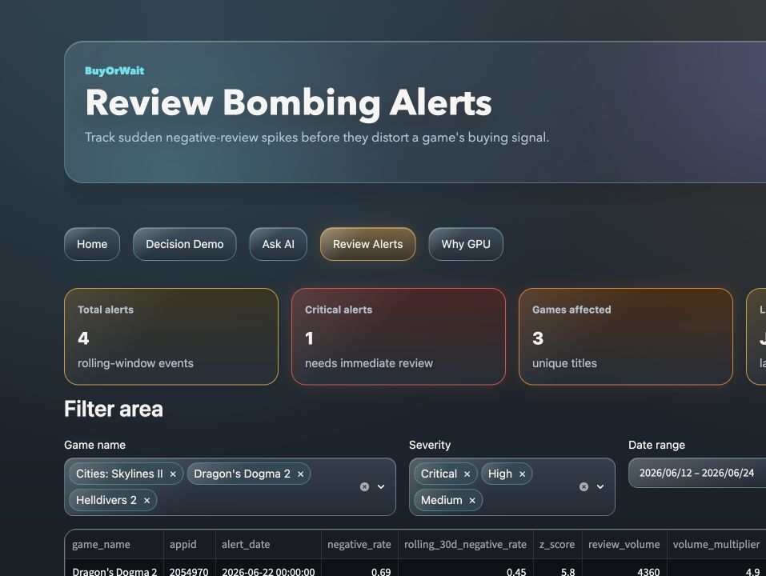
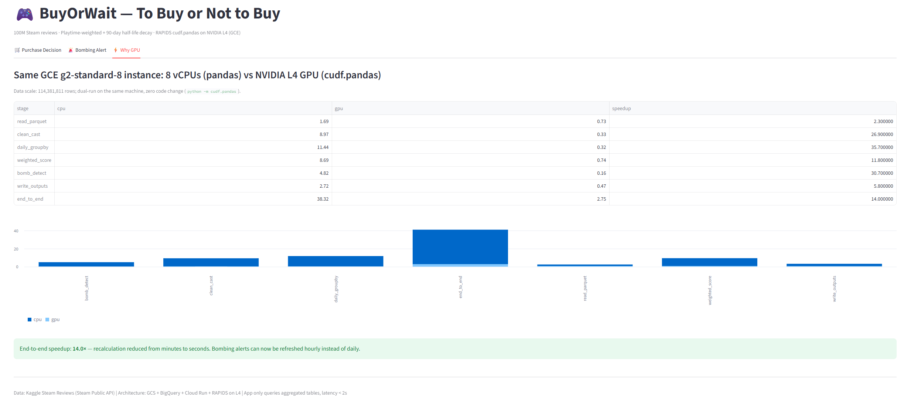

# BuyOrWait 🎮 — To Buy or Not to Buy

> Steam sentiment intelligence powered by NVIDIA RAPIDS acceleration — overall rating can be misleading; recent weighted sentiment is the truth.

**🔗 Live Demo:** _coming soon (Cloud Run public URL)_ · **🎬 Demo Video (≤3 min):** _coming soon_ · **📊 Looker Studio:** [Interactive Dashboard](https://datastudio.google.com/reporting/46e5a8c2-ce33-4179-a456-5d68db932760) ([setup guide](docs/looker_studio.md))

BuyOrWait is a purchase-decision tool built on **114M+ Steam reviews**. Steam's overall rating blends years-old sentiment with today's, hiding both games that have been fixed and games being review-bombed right now. BuyOrWait computes a playtime-weighted, 90-day half-life **Purchase Confidence Score** (🟢 Buy / 🟡 Wait / 🔴 Skip) and raises **Bombing Alerts** via rolling z-score anomaly detection — plus a **💬 Ask Gemini** tab that turns plain-English questions into BigQuery SQL. The entire pipeline runs unchanged on CPU (pandas) and GPU (`cudf.pandas` on an NVIDIA L4): **~14× faster end-to-end (38.3s → 2.7s)** — turning bombing alerts from a daily batch into an hourly refresh. Stack: Cloud Storage + BigQuery + Cloud Run (Streamlit) + Gemini (Vertex AI) + Looker Studio + NVIDIA RAPIDS.

## Architecture

```
Kaggle (100M+ reviews, 17GB CSV)
   ▼ kaggle CLI / aria2 download + convert_to_parquet.py
Cloud Storage (Slim Parquet, no text columns, ~3-4GB)
   ▼
GCE g2-standard-8 (NVIDIA L4) — cudf.pandas batch processing
   Clean → Game×Day Aggregation → Weighted Confidence Score → Bombing Detection → Phase Timings
   ▼
BigQuery: game_daily / game_scores / alerts / benchmark_results (+ v_* views for Looker)
   ▼                                    ▼
Cloud Run — Streamlit                 Looker Studio — exec dashboard
   🛒 Purchase Decision | 🚨 Bombing Alert | ⚡ Why GPU
   💬 Ask Gemini — natural language → SQL via Gemini (Vertex AI), read-only guarded
```

## Benchmarks

Same GCE `g2-standard-8` instance, dual run over **114,381,811 rows**: 8 vCPUs (`pandas`) vs NVIDIA L4 (`cudf.pandas`), **zero code changes**. Raw timings: [benchmarks/benchmark_results.csv](benchmarks/benchmark_results.csv).

| Phase | pandas (CPU) | cudf.pandas (L4) | Speedup |
|---|---|---|---|
| read_parquet | 1.69s | 0.73s | 2.3x |
| clean_cast | 8.97s | 0.33s | 26.9x |
| daily_groupby | 11.44s | 0.32s | 35.7x |
| weighted_score | 8.69s | 0.74s | 11.8x |
| bomb_detect | 4.82s | 0.16s | 30.7x |
| write_outputs | 2.72s | 0.47s | 5.8x |
| **end_to_end** | **38.32s** | **2.75s** | **~14x** |

Hardware: GCE g2-standard-8 (8 vCPUs / 32GB RAM / NVIDIA L4 24GB), Ubuntu 24.04 Deep Learning Image, CUDA 12.x.



## Screenshots





## Reproduction

```bash
# 0. Data: Kaggle "100 Million+ Steam Reviews" (~17GB CSV, reviews through 2023-10-30)
#    https://www.kaggle.com/datasets/kieranpoc/steam-reviews
kaggle datasets download -d kieranpoc/steam-reviews -p ~/raw --unzip

# 1. Raw CSV -> Slim Parquet (drops review text, 17GB -> ~3-4GB)
#    First run prints column names; verify the COLS mapping,
#    uncomment convert() at the bottom, then rerun.
python pipeline/convert_to_parquet.py

# 2. Benchmarks — same machine, zero code change
python pipeline/pipeline.py cpu                    # pandas baseline
python -m cudf.pandas pipeline/pipeline.py gpu     # RAPIDS on L4
# No GPU at hand? Verify the CPU path on a subset in ~1 minute:
MAX_FILES=3 python pipeline/pipeline.py cpu

# 3. Load results into BigQuery
bq mk --location=asia-southeast1 -d steam_intel
bq load --source_format=PARQUET --replace steam_intel.game_daily  out_game_daily.parquet
bq load --source_format=PARQUET --replace steam_intel.game_scores out_game_scores.parquet
bq load --source_format=PARQUET --replace steam_intel.alerts      out_alerts.parquet
bq load --source_format=CSV --autodetect --replace steam_intel.benchmark_results benchmark_results.csv

# 4. App (local)
cd app && pip install -r requirements.txt
GCP_PROJECT=your_project_id streamlit run app.py
# 💬 Ask Gemini tab: set GEMINI_API_KEY (Google AI Studio), or skip it and use
# Vertex AI on Cloud Run (step 5) with no key at all.

# 5. Deploy to Cloud Run (uses app/Dockerfile)
# One-time, for the Ask Gemini tab via Vertex AI (key-less):
#   gcloud services enable aiplatform.googleapis.com
#   + grant the Cloud Run service account roles/aiplatform.user
gcloud run deploy buyorwait --source app --region asia-southeast1 \
  --allow-unauthenticated --max-instances 2 \
  --set-env-vars GCP_PROJECT=your_project_id

# 6. Looker Studio dashboard (optional, ~10 min) — see docs/looker_studio.md
bq query --use_legacy_sql=false < docs/looker_views.sql
```

The app queries only the aggregated BigQuery tables (a few thousand rows), never the 114M-row raw data — responses stay under 2 seconds on a scale-to-zero Cloud Run service.

## Metric Definitions

- **Purchase Confidence Score**: `score = Σ(wᵢ·voteᵢ)/Σ(wᵢ) × 100` where `wᵢ = log(1+playtime_at_review) × exp(−age_days/90)`. Playtime weight filters out "casual" review noise, and the 90-day half-life decay ensures recent sentiment dominates.
- **Bombing Alert**: Daily negative review rate z-score (relative to 30-day rolling average) > 3, and daily review count > 2x of 30-day rolling average (dual conditions to avoid false positives on small sample sizes).
- **Data window**: the Kaggle snapshot contains reviews **through 2023-10-30**. The pipeline anchors "today" to the newest review in the data, so "recent 90d" means the 90 days before the snapshot date. Wiring the Steam API for incremental ingestion would make it live — the ~14× GPU speedup is exactly what makes hourly full recalculation practical.

## Repository Layout

```
pipeline/     convert_to_parquet.py (CSV -> slim Parquet), pipeline.py (timed CPU/GPU pipeline)
app/          Streamlit app + Dockerfile (Cloud Run)
benchmarks/   benchmark_results.csv, nvidia-smi.png, hardware details
notebooks/    eda_sample.ipynb — small-sample EDA behind the metric design
docs/         app screenshots, Looker Studio setup guide + views SQL
```

## License

[MIT](LICENSE)

Data Source: Kaggle Steam Reviews (all sourced from public Steam APIs).
