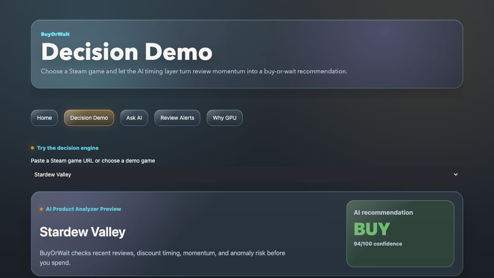

# BuyOrWait — fork 学习记录

本仓库 fork 自 [hypoxic127/buyorwait](https://github.com/hypoxic127/buyorwait)。上游实现了 Steam 评价聚合、加权购买分数、差评异常检测和 Streamlit/BigQuery 展示。

当前 fork 的独有改动是 README 整理；CPU/GPU 管线、Notebook、部署截图和基准 CSV 来自上游，不能作为本 fork 独立实现或复测的成果。原始 [MIT 版权声明](LICENSE) 保留。

## 目录

| 路径 | 用途 |
| --- | --- |
| `pipeline/` | CSV 转 Parquet、CPU/GPU 聚合与计时 |
| `app/` | Streamlit 界面、BigQuery 查询与可选 Gemini |
| `benchmarks/` | 上游计时 CSV、硬件截图和说明 |
| `notebooks/` | 上游小样本 EDA |
| `docs/` | 界面截图、Looker 查询和重建说明 |

## 运行与数据

[重建说明](docs/reproduction.md)区分数据转换、CPU/GPU 处理和云端应用所需资源。原始 Steam 数据、GPU 环境、BigQuery 表、云端身份和模型凭证没有随 Git 仓库提供；不是 clone 后即可离线启动的演示。

现有管线以数据中最新日期作为参照，`recent 90d` 指数据快照末尾的90天。评分权重为 `log(1 + playtime) × exp(-age_days / 90)`；这里90天是指数衰减时间常数，对应半衰期约62.4天，旧首页的“90天半衰期”描述不准确。此次文档整理没有改变上游算法。

## 上游记录与边界

[基准记录](benchmarks/README.md)报告了同一台 GCE/L4 环境的 CPU/GPU 计时，CSV 和截图保持原样。本 fork 没有独立重跑1.14亿条数据、GPU测速、云端演示或模型问答；不将上游约14倍结果写成个人测量。

模型生成 SQL、购买评分和异常阈值是研究实现，需要对数据时点、查询与输出分别审查；其分数不等于已验证的购买建议。
